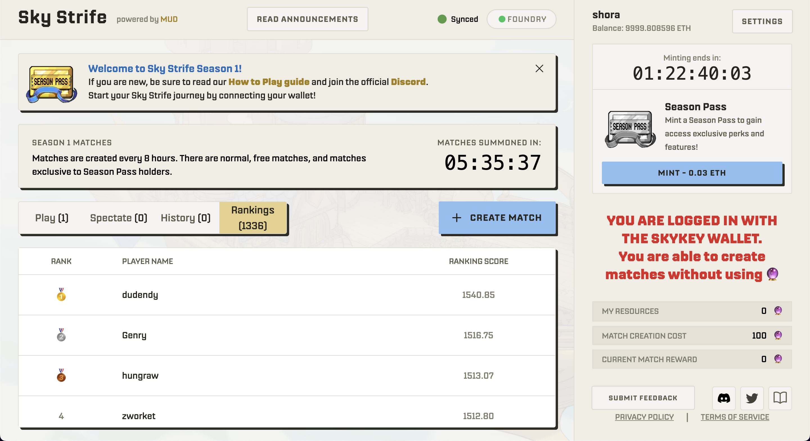
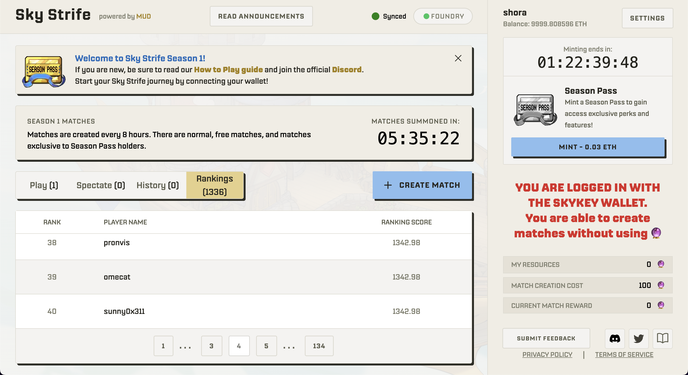

# Rating System for Sky Strife

## Background
Due to the Orb emission schedule, players finishing in third or fourth place often experience a net loss in Orbs, making it challenging for newcomers and beginners to casually engage in matches. To address this, we have developed a system to objectively assess player skills, laying the groundwork for future improvements in matchmaking. The rating system is beneficial for several reasons:
- It motivates players to improve their ranks.
- It creates social effects by displaying rankings on the leaderboard.
- It serves as a foundation for future plugins, which are discussed in more detail below.

## Tools Used
- **[skystrife-public](https://github.com/latticexyz/skystrife-public)**: The official codebase provided by SkyStrife. This project was developed based on it.
- **[Trueskill](https://trueskill.org/)**: A rating calculation system developed by Microsoft.

## Demo

## Development Details
- Developed the `skystrife-api` to fetch historical match data and player information. Please see [here](https://github.com/0xshora/skystrife-api) for details.
- Utilized Trueskill to calculate ratings based on past match data.
- Enhanced the `skystrife-public` to display calculated scores on the frontend.

## How to Operate
- To fetch new API data, refer to `skystrife-api/src/routes.ts`.
- To calculate ratings, run `skystrife-api/src/cul_ranking_scores.ipynb` using the retrieved JSON file.
- Save the processed JSON file in the specified location.
- Refer to the `skystrife-public` README for startup instructions.

## Future Work
Developing plugins that use rating scores for improved matchmaking is feasible and significant. Such plugins would not only enhance the quality and satisfaction of gameplay by matching players of similar skills but also play a crucial role in attracting new players. Additionally, having objectively assessed strong players could introduce strategic elements during play, like prioritizing whom to attack.
